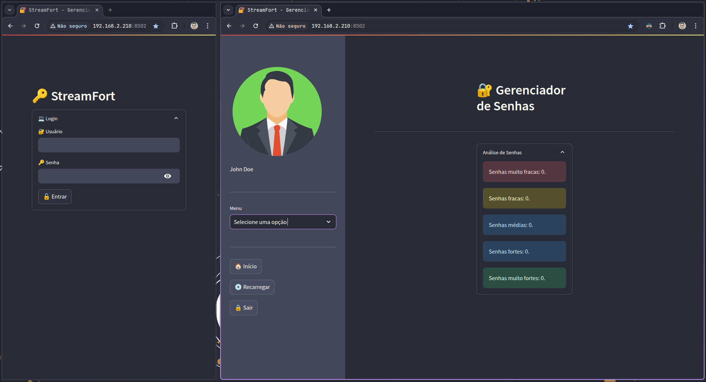
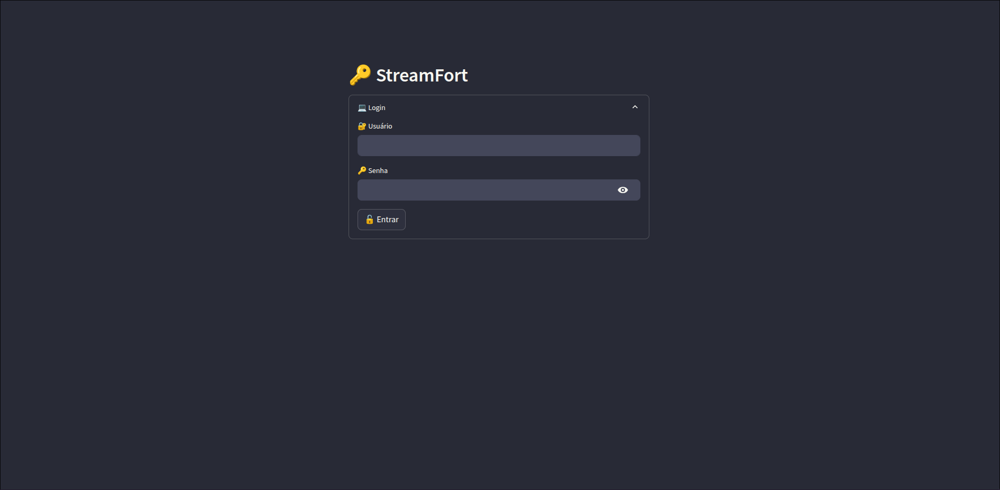
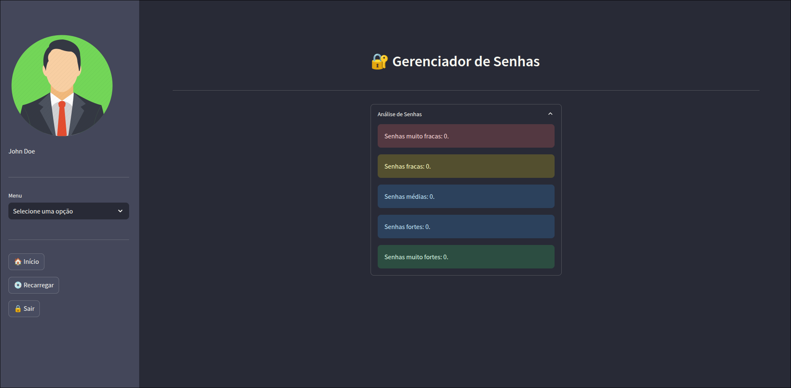
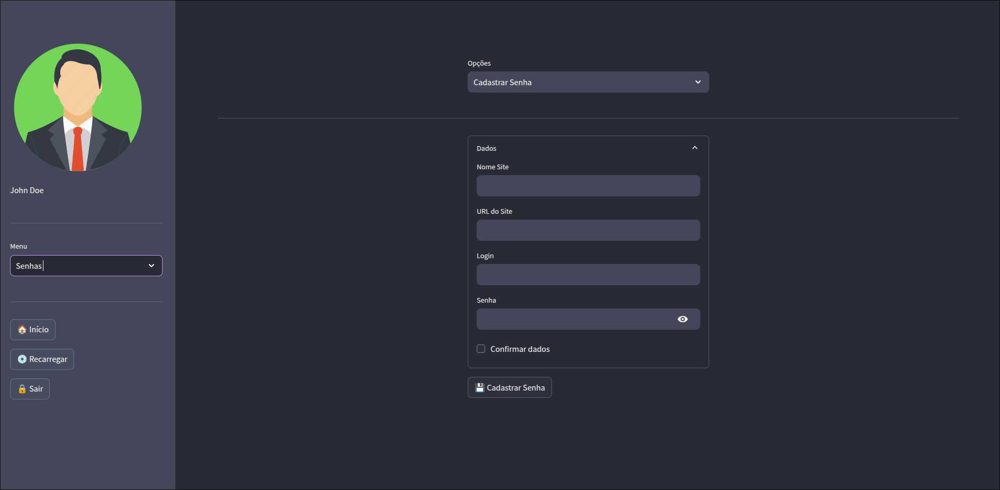
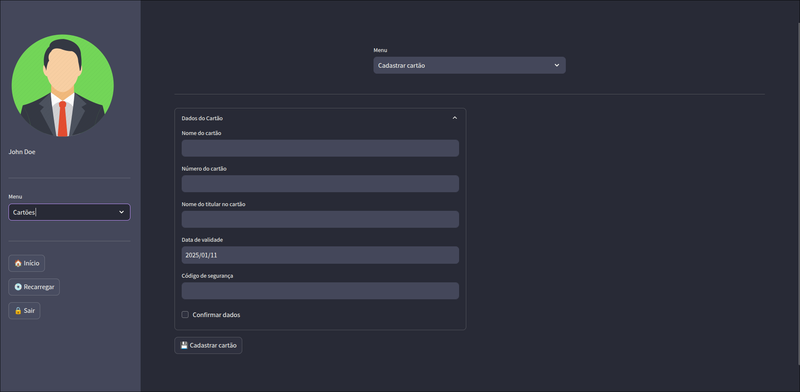
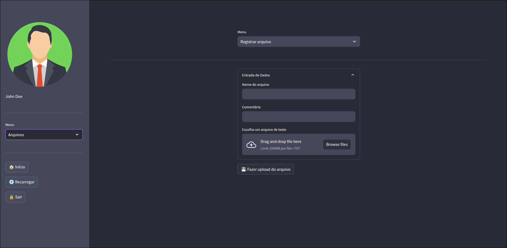

# 🔒 StreamFort

Um aplicativo de gerenciamento de senhas, arquivos confidenciais, cartões e contas. Feito em **[Python](https://www.python.org/)**, através do framework **[Streamlit](https://streamlit.io/)**, integra-se ao banco de dados **[MySQL](https://www.mysql.com/)**, permitindo o armazenamento de informações confidenciais.

## 🛠 Sobre o Projeto

Este projeto é um software livre e está disponível para uso, modificação e distribuição, de acordo com os termos da licença [**MIT**](LICENSE). Ele é mantido unicamente por mim, e contribuições da comunidade são muito bem vindas.

## ✨ Funcionalidade

- Cadastro e consulta de senhas, arquivos confidenciais, cartões e contas bancárias.

## 🚧 Limitações

- **Versão nativa para Windows**: Atualmente, o projeto não oferece suporte nativo para sistemas Microsoft Windows, devido a um erro na execução do Streamlit em conjunto com o conector MySQL para o Python, que faz com que o processo seja encerrado em sequência. Devido a isso, a alternativa é a execução do aplicativo através do **[Subsistema Linux para Windows](https://learn.microsoft.com/pt-br/windows/wsl/install)**;
- **Escalabilidade**: A solução foi projetada para uso em rede local, apesar de ser possível o acesso externo através do encaminhamento das portas usadas pelo Streamlit, utilizando o utilitário **[Ngrok](https://ngrok.com/)**;

- **Autenticação**: Não há suporte ao login por email e autenticação de dois fatores no momento, o que pode representar uma limitação de segurança.

## 📸 Demonstração

   
Imagens

   ---

   
   *Tela de login.*

   ---

   
   *Tela inicial mostrando a análise de senhas.*

   ---

   
   *Tela de cadastro de senhas.*

   ---

   
   *Tela de cadastro de cartões de crédito.*

   ---

   
   *Tela de upload de arquivos.*

   ---

   
Vídeo explicativo

   

---

## 🛤️ Roadmap

Melhorias planejadas para futuras versões:

- Exibição em lista de cards para cartões de créditos e contas bancárias;
- Desenvolvimento de uma API para o backend do aplicativo, através do framework **[Django](https://www.djangoproject.com/)**;
- Funcionalidade para geração de senhas;
- Funcionalidade para download de arquivo comprimido com os registros confidenciais do usuário;
- Aplicativo móvel para Android e iOS, desenvolvido através do framework **[Flet](https://flet.dev/)**.

## 💡 Contribuições

Contribuições são sempre bem vindas! Se quiser ajudar a melhorar o projeto, você pode:

- Propor melhorias ou novas funcionalidades na aba **Issues** deste repositório;
- Enviar pull requests com correções de bugs ou novos recursos.

Certifique-se de ler o arquivo [CONTRIBUTING.md](documentation/pages/CONTRIBUTING.md) antes de contribuir.

## 🐞 Relatório de Bugs e Problemas

Se encontrar algum bug ou problema, você pode informa-lo na aba **Issues** deste projeto. Por favor, inclua informações detalhadas, como:

- Passos para reproduzir o problema;
- Sistema operacional e ambiente;
- Mensagens de erro relevantes.

⚠️ **Atenção:** Este projeto é desenvolvido e mantido em meu tempo livre e, por isso, os bugs reportados serão analisados e corrigidos conforme a minha disponibilidade. Agradeço pela paciência e compreensão.

## Instalação

Para realizar a instalação, siga o passo a passo: 

- [Instalação em ambientes Microsoft Windows](documentation/pages/Linux_Installation.md)
- [Instalação em ambientes GNU/Linux de base Debian](documentation/pages/Windows_Installation.md)

---

## 📜 Licença

Este projeto é licenciado sob a licença [MIT](LICENSE).

   A Licença MIT permite o uso, cópia, modificação e distribução do código do projeto, sem restrições. No entanto, a única exigência é que a licença original e o aviso de direitos autorais sejam mantidos, ou seja, deve-se deixar claro de onde o código veio.

 Sinta-se à vontade para usá-lo e modificá-lo conforme necessário.

## 📚 Referências

- [Documentação do Streamlit](https://docs.streamlit.io/)
- [MySQL Community Edition](https://dev.mysql.com/downloads/)
- [Python](https://www.python.org/)
